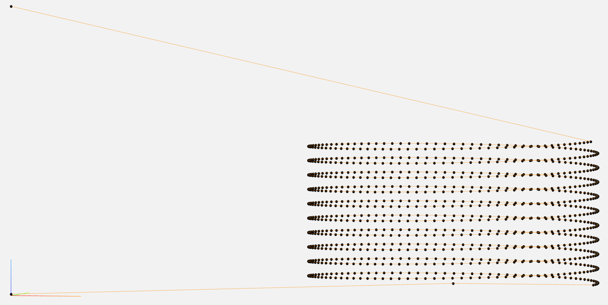

# gcodepy
`gcodepy` is a g-code generator for 3D printers that use [Marlin Firmware](https://github.com/MarlinFirmware/Marlin).
This project was heavily inspired by [Full Control GCODE](http://fullcontrolgcode.com/).
It is essentially my own take on the concept of writing g-code through an abstraction layer, using Python instead of Excel/VBA.

## Why would I want to write g-code with Python?
To be honest, there aren't usually many occasions where using an interface layer like `gcodepy` or Full Control GCODE are better than the CAD/slicer workflow.
However, there are occasions where being able to programmatically define your printer's movements can be useful.
One possible use of interface layers is in defining motions using mathematical functions.
For example, `gcodepy` supports essentially any other Python code, so you can create any function with the correct output as input for movement even using other libraries such as `numpy`.

Thomas Sanladerer created a [blog post and associated video](https://toms3d.org/2021/10/08/full-control-gcode/) about the potential uses of Full Control GCODE, which also applies to `gcodepy`. Notably, he created some very interesting geometric lampshade-esque objects.

## Installation
`gcodepy` is [available on PyPI](https://pypi.org/project/gcodepy/) and so can be installed with `pip`.
```
$ pip3 install gcodepy
```
Note that `gcodepy` has only been tested with Python 3.X and no guarantees are made about compatibility with the deprecated Python 2.X.

## Examples
One of the most interesting things to do with `gcodepy` is to do toolhead movements using mathematical functions.
For example, you can make your printer go in a spiral:

This example is defined in `examples/zspiral.py`.
For more examples, check the `examples` folder.

## Planned features
- cleaner gcode output (particularly feedrates)
- better interfacing for absolute movements
- better detection + handling of invalid inputs/movements

